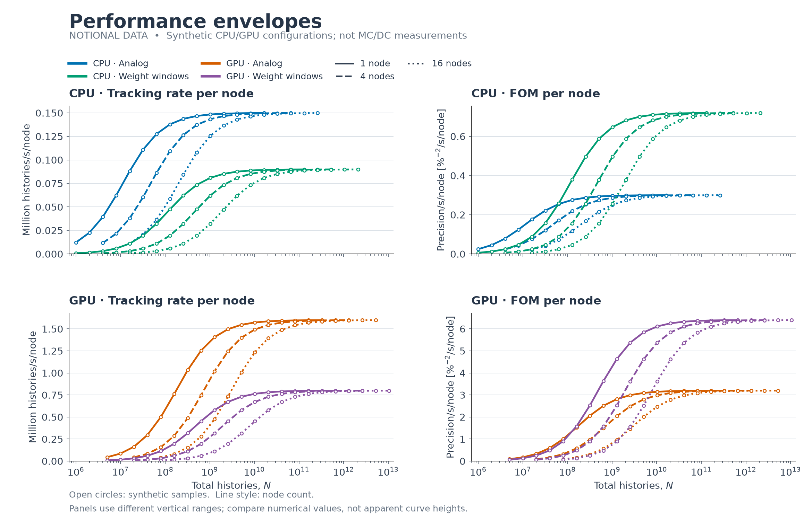
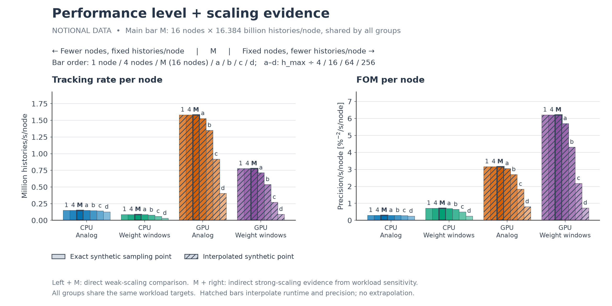

# Performance comparisons and scaling summaries

This note proposes the presentation of serial and parallel performance results across platforms and transport methods such as analog transport and weight windows.
It is a design proposal, not a description of features already implemented in the suite processors.
Every figure below uses synthetic data and must not be interpreted as a measurement of Dane, Tuolumne, or any MC/DC method.

## Primary view: the complete performance curves

Plot performance against total source histories, $N$, with separate curves for platform, method, and node count.
Use a logarithmic history axis to expose the overhead-dominated regime, the transition toward sustained throughput, and any asymptotic plateau.
Per-node throughput can have an S-like shape on these axes; this is an observed behavior to look for, not a shape to impose on measured data.
Runtime and precision need not have the same shape or reach a plateau.
Faceting by platform or metric keeps the curves readable when many combinations are present.



In this illustration, the faster synthetic GPU configuration needs more histories to amortize its overhead, especially at higher node counts.
The synthetic weight-window method tracks fewer histories per second but achieves more precision per history, giving it a higher one-node FOM.
Weight windows is deliberately assigned a larger fixed per-run overhead, so it needs more histories per node to amortize that cost.
At fixed total histories, increasing the node count reduces work per node and makes this overhead a larger fraction of runtime, giving weight windows more challenging strong scaling.
The weight-window FOM advantage therefore shrinks and can reverse at larger node counts before saturation, illustrating the distinction between statistical efficiency and scaling consistency.
For each platform and method, every node-count curve approaches the same tracking-rate and FOM plateau; node-dependent overhead delays that approach but does not lower the asymptotic limit.
Equal asymptotes are an assumption of this notional model, not a guarantee for measured performance.
These are illustrative behaviors, not predictions for the actual cases.
The combined summary below uses a common maximum histories-per-node target on each largest-node curve as its main bar, with a weak-scaling wing to its left and a lower-workload wing to its right.

## Metrics and normalization

Let $T$ be measured total elapsed runtime in seconds, including compilation and output, and let $P$ be the number of allocated nodes.
For serial single-process results, use $P=1$ for these formulas but label the result as single-process performance rather than full-node utilization.
Let $s_i$ be the reported standard error (`sdev`) of the current run's tally mean, and let $\mu_{i,\mathrm{ref}}$ be a fixed reference tally mean.
Use one common reference output across the platforms and methods being compared, selected from the largest available total-history result and recorded explicitly.
Only compare matching physical observables, scores, grids, and normalization conventions.
The contributing bin mask is fixed by nonzero reference means, not by each run's own nonzero bins.

$$
V = 10^4\max_{i:\mu_{i,\mathrm{ref}}\ne0}
\left(\frac{s_i}{\mu_{i,\mathrm{ref}}}\right)^2.
$$

Here $V$ is maximum relative variance in percent squared; retain fractional variance separately if needed for provenance.

| Metric | Definition | Unit |
| :--- | :--- | :--- |
| Runtime | $T$ | s |
| Tracking rate per node | $R=N/(PT)$ | histories/s/node |
| Precision | $Q=1/V$ | $\%^{-2}$ |
| Precision rate | $q=1/(VN)$ | $\%^{-2}$/history |
| FOM per node | $F=1/(PTV)=Rq$ | $\%^{-2}$/s/node |

Precision characterizes the combined result and is not divided by node count.
Precision rate is already normalized per history and is not divided by node count either.
Per-node comparisons describe the complete allocated node configurations, not equal power consumption, purchase price, or CPU/GPU device count.
Keep batch counts and problem settings consistent and record differences in algorithms, hardware, compilation settings, and allocation details.

## Combined summary: performance level and scaling evidence

Create one group for each platform and method combination, with touching bars and a gap only between groups.
Select the largest available node count for each group, denoted $P_{\max}$, and use a common maximum histories per node $h_{\max}$ across all groups.
Choose the largest $h$ covered by every curve included in the comparison, including smaller-node curves on the left wing.
Use the result at $N=P_{\max}h_{\max}$ as the main bar, labeled M, interpolating when no exact measurement exists.
This shared target can be below a group's own largest measured workload; retain those larger measurements in the full performance curves.
To its left, hold $h=h_{\max}$ fixed and decrease node count moving outward from M.
To its right, hold $P=P_{\max}$ fixed and decrease histories per node moving outward from M.
Draw the bars touching, emphasize M with a dark fill and thicker outline, and lighten the wings away from it.
Record the selected node counts and common maximum histories per node explicitly.
Use the same geometric reduction factors for the right wing across every group.
Use separate panels for tracking rate per node and FOM per node.
Precision rate can be shown in an additional panel when the statistical efficiency of the methods needs emphasis.



This illustration has seven bars in each group, in the following left-to-right order.

| Bar | Nodes | Histories per node | Role |
| :--- | :--- | :--- | :--- |
| 1 | 1 | $h_{\max}$ | Weak-scaling wing, farthest left |
| 4 | 4 | $h_{\max}$ | Weak-scaling wing, adjacent to M |
| M | 16 | $h_{\max}$ | Common maximum-workload anchor |
| a | 16 | $h_{\max}/4$ | Lower-workload wing |
| b | 16 | $h_{\max}/16$ | Lower-workload wing |
| c | 16 | $h_{\max}/64$ | Lower-workload wing |
| d | 16 | $h_{\max}/256$ | Lower-workload wing, farthest right |

M is selected by workload, not by searching for the largest measured rate or FOM, so it need not be the tallest bar.
Here $h_{\max}=16.384$ billion histories per node for every group, and each rightward step divides that workload by four.
CPU bars use exact synthetic samples, while GPU bars require interpolation and are marked with hatching, including their main bars.

The main bar shows performance at the largest tested allocation and the common maximum workload per node.
Its height reflects both underlying platform-and-method performance and any weak-scaling losses; height alone does not measure scaling efficiency.
Corresponding bars have matching total workloads when their node counts also match, as in this illustration.
If groups use different maximum node counts, matching histories per node alone does not imply matching total histories.

### Right wing: workload sensitivity and indirect strong-scaling evidence

Compare M with the bars to its right, where the node count stays fixed.
Flatter per-node tracking-rate bars as histories per node decrease are evidence suggesting better strong scaling, while a steeper drop suggests worse strong scaling.
This is indirect evidence, not a direct strong-scaling measurement or a prerequisite for good strong scaling.
The comparison probes sensitivity to reduced work per node but does not capture extra communication or load-balancing costs from increasing node count.
Similar heights near M also indicate workload saturation at that node count.
Strong scaling instead holds total histories $N^*$ fixed and compares different node counts, with tracking-rate ratios $R(P,N^*)/R(P_0,N^*)=P_0T(P_0,N^*)/[PT(P,N^*)]$.
That comparison can still be extracted from overlapping points on the full performance curves if needed.
FOM also depends on estimated precision, so changes in its bars should be interpreted together with tracking rate and precision rate.
Random uncertainty in the variance estimate can affect the FOM bars, especially with limited independent batches.

### Left wing: direct weak-scaling comparison

Compare M with the bars to its left, which vary node count while holding that group's $h=h_{\max}$ fixed.
Moving outward to the left decreases node count; reading toward M increases it.
The histories-per-node value is common across all groups as well as within each left wing.
The total workload now increases with node count as $N=hP$.
Group height shows performance level at the selected $h$, while consistency within each group shows whether that level is maintained as the allocation grows.

All platform-and-method groups have nearly flat left wings because increasing the node count no longer reduces the workload available to each node.
The larger weight-window overhead stays approximately constant relative to the transport work at fixed histories per node, so it lowers the performance level without materially reducing weak-scaling consistency.
Only a small common node-dependent overhead produces a slight decline as the allocation grows.
The contrast is therefore good weak scaling for both methods but more challenging strong scaling for weight windows; this is an illustrative assumption rather than a claim about measured MC/DC behavior.

At fixed $h$, per-node tracking rate is $R(P,hP)=h/T(P,hP)$, so its bar-height ratio relative to $P_0$ is the weak-scaling efficiency:

$$
\frac{R(P,hP)}{R(P_0,hP_0)}
=\frac{T(P_0,hP_0)}{T(P,hP)}.
$$

Flat tracking-rate bars indicate ideal weak scaling at the chosen workload per node, not necessarily saturation or high absolute performance.
Left-wing bars taller than M reveal a loss of per-node performance as the allocation grows toward the main run.
FOM per node is $F(P,hP)=q(P,hP)h/T(P,hP)$; its consistency reflects both timing and precision per history.
The combined precision generally increases with total histories, so weak scaling does not require the raw precision to stay constant.
Use the shared reference solution and bin mask, and inspect precision rate when changes in FOM are not explained by timing.

| View | Workload selection | Main interpretation |
| :--- | :--- | :--- |
| Full performance curves | All measured total histories | Overhead, workload saturation, and sustained performance |
| Main bar M | Most nodes and common maximum histories per node | Achieved performance level at a shared workload per node |
| Left wing + M | Common fixed $h_{\max}$ across groups, varying nodes | Direct weak-scaling comparison |
| M + right wing | Fixed $P_{\max}$, varying histories per node | Workload sensitivity and indirect strong-scaling evidence |

These complementary views present achieved performance, saturation, and weak-scaling behavior without requiring separate efficiency-versus-node plots.
Peak height alone does not establish weak-scaling efficiency; maintaining per-node performance at fixed $h$ is the relevant comparison.

## Calibrated workloads and interpolation

Platform-specific particle baselines are useful for obtaining meaningful runtime ranges on machines with different throughputs.
Use actual total histories from the output rather than equating matching workload multipliers across platforms.
Different sampling grids still permit quantitative comparisons of sustained per-node tracking rate and FOM, provided the curves demonstrate that regime.

The combined summary requires a common histories-per-node range across the curves used for its main bars and left wings.
Choose $h_{\max}$ as the upper end of that intersection and verify that the intersection is nonempty.
Every right-wing target must also be covered by all included largest-node curves.
Use one common reduction factor and only the number of steps supported across all groups; otherwise collect more measurements or explicitly show missing bars.
Never silently substitute different workloads for individual groups or extrapolate.
If a fixed-total-history strong-scaling comparison is also desired, its $N^*$ must lie in the intersection of the measured history ranges of every included curve.
For each left-wing point, evaluate its curve at $N=h_{\max}P$.
Prefer exact measurements when present and use piecewise linear interpolation of runtime versus total histories only between neighboring measurements.
For precision-dependent metrics, also interpolate precision $Q=1/V$ versus histories, then derive $q=Q/N$ and $F=Q/(PT)$ consistently at the selected target $N$.
Linear precision interpolation is an approximation motivated by the common large-sample behavior $V\propto1/N$; it must not be assumed reliable across sparse or noisy data.
Do not independently interpolate tracking rate, precision rate, and FOM in a way that breaks $F=Rq$.
Do not extrapolate, bridge invalid variance estimates, or hide large gaps between bracketing measurements.
Mark interpolated bars distinctly and retain the reference, target histories, bracketing points, and interpolation method in the eventual exported table.
Add direct measurements when an important conclusion depends on a poorly constrained interpolation.

The present five-point parallel matrix uses workload multipliers from 1 through 16 and node counts from 1 through 64.
For one fixed baseline, the one-node history range ends at 16 baseline workloads, while the 64-node range begins at 64 baseline workloads.
Consequently, there is no fixed-history overlap across all seven node counts, even before comparing different platform baselines.
For such a strong-scaling comparison, use a subset of node counts, collect additional overlap points, or show separately labeled workload panels instead of extrapolating.
The synthetic figures intentionally use wider sampling ranges to provide a common workload across all illustrated curves.
Within a platform, each fixed-multiplier column of the existing matrix already gives a weak-scaling series if the batch count is unchanged.
Different platform baselines can give different histories per node at matching multipliers, so a cross-platform weak-scaling summary may still require interpolation or additional overlap measurements.

## What to call "ultimate performance"

The main bar M of each group is a candidate for its ultimate performance at the largest tested node count only if the common $h_{\max}$ reaches its plateau.
Otherwise label it as performance at the common maximum workload per node, not ultimate or asymptotic performance.
The common target may be too small to saturate a faster platform or a higher-overhead method even when its full curve reaches a plateau at larger workloads.
The bars to its right reveal whether performance is already stable over a range of lower workloads on the same nodes.
The bars to its left directly show how well per-node performance is maintained as node count grows at its selected $h_{\max}$.
The left wing describes near-asymptotic weak scaling only if that workload reaches the sustained-performance regime for every included node count.
Largest-history endpoints are a valid weak-scaling series only when they also share the same histories per node; that cannot be assumed across differently calibrated platforms.
Always retain the full performance curves as the primary evidence rather than relying on a single summary.

## Reproduce the illustrations

From the repository root, with NumPy and Matplotlib installed:

```console
python performance/design/generate_notional_plots.py
```

The script writes two PNG figures beside this note under `figures/` and does not read or change any simulation outputs.
The synthetic timing model is $T(P,N)=T_0+A_m+b\log_2P+N/(Pr)$, where $r$ is the platform-and-method-specific asymptotic throughput per node.
The illustrative method overhead $A_m$ is zero for analog and larger for weight windows, while all configurations use the same small node-cost coefficient $b=2$ seconds per doubling.
At fixed histories per node $h$, this becomes $T=T_0+A_m+b\log_2P+h/r$, which changes only slightly with node count.
Consequently, $R=N/(PT)$ approaches $r$ for every node count, and FOM per node approaches $rq$ with the prescribed precision rate $q$.
The synthetic sampling ranges extend until every curve exceeds 99.9% of its analytical asymptotic throughput, and the plot limits include every generated point.
This exposes the plateau through additional synthetic samples rather than artificially flattening the curves.
The synthetic sampling ranges cover the common $h_{\max}$ and all right-wing targets, using interpolation where these targets fall between samples.
The combined summary uses the same synthetic model and data as the full performance curves.
Method-specific precision per history is prescribed purely to illustrate how tracking rate and FOM can rank methods differently.
No uncertainty bars are shown because these are deterministic illustrations, not repeated measurements.
