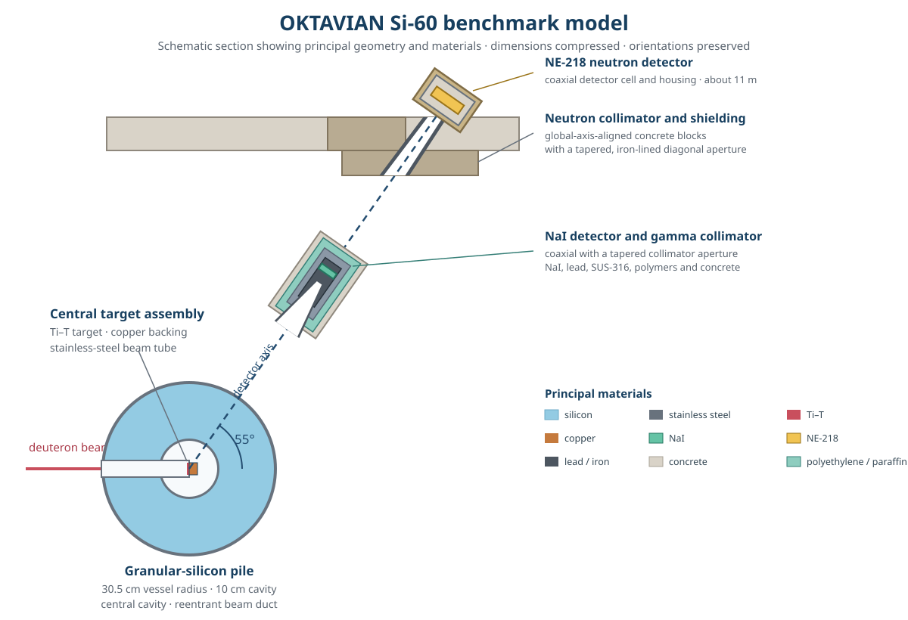

# OKTAVIAN Si-60 neutron leakage

This case represents the 60 cm silicon-pile experiment in SINBAD V2 benchmark **FUS-ATN-BLK-STR-PNT-003-FGS** (legacy entry NEA-1553/52), performed at the OKTAVIAN facility on 13 March 1987. The official package ranks the 60 cm experiment as benchmark quality for nuclear-data validation [1, 2].

The experimental assembly consists of a spherical stainless-steel vessel filled with granular silicon around a central cavity and penetrated by a reentrant beam duct. A collimated detector line at 55 degrees to the deuteron-beam axis views the pile with an NE-218 neutron detector about 11 m from the target and a NaI photon detector about 5.8 m from the target. The MC/DC input implements the supplied detailed, detector-explicit 3-D gamma-analysis geometry, including the neutron collimator and detector system as well as the complete NaI detector collimator represented by the supplied MCNP model. The nuclide number densities follow the MCNP model rather than being reconstructed from elemental compositions or present-day natural abundances; natural-carbon and natural-argon entries are expanded into explicit isotopes. Every material is assigned 293.6 K to select room-temperature nuclear data, an explicit computational assumption because the benchmark provides neither a measured sample temperature nor an MCNP `TMP` specification.

The experiment was driven by a pulsed D-T neutron source produced by 250 keV deuterons incident on a Ti-T target at the center of the pile. The source-neutron energy and yield vary with emission angle [3]. MC/DC approximates the MCNP-supplied continuous energy-angle relation with 2,304 weighted source components: 32 equal direction-cosine bins, each resolved by 72 paired energy-angle samples obtained by linear interpolation of the tabulated yield and energy. Because the supplied law defines one energy at each direction cosine rather than a conditional energy spectrum, this refinement follows that correlated curve without introducing an unsupported energy spread. The supplied 0.3 cm-radius source disk is represented by an equal-area square footprint distributed uniformly through the modeled 0.0011 cm Ti-T target thickness because MC/DC does not yet provide an exact finite disk-source sampler.

The benchmark quantities of interest are the energy-dependent neutron- and neutron-induced photon-leakage spectra emerging from the pile. The neutron spectrum was not measured calorimetrically at the pile surface: the NE-218 detector recorded a time-of-flight spectrum along the collimated detector line, neutron energies were inferred from the flight times, counts were corrected for detector efficiency, and absolute leakage was normalized using the monitored source strength [4, 5]. The tabulated result is therefore a processed leakage-current spectrum per source neutron rather than raw detector counts. The present comparison estimates the published neutron energy spectrum with an energy-filtered detector-cell track-length tally; the companion photon comparison will follow the addition of photon production and transport.

Validation is restricted to the complete published energy bins from **3.0288 to 13.574 MeV**, the bin boundaries nearest the approximately 3-13.5 MeV defensible region identified by the benchmark assessment. Below about 3 MeV, background subtraction, room return, and low-energy detector-response effects are insufficiently specified. Above about 13.5 MeV, the result is dominated by the D-T source peak and becomes strongly dependent on the source energy-angle law, timing and energy resolution, detector response, and incompletely documented data reduction. Results outside this interval are therefore excluded rather than used as validation evidence.

The published experimental uncertainties are binwise one-standard-deviation counting uncertainties, but they omit the reported 0.4-1% niobium-foil/source-normalization contribution and provide no experimental covariance matrix [1, 2]. Covariances and prescribed uncertainties are also unavailable for the angular source law, source energy, detector response, timing, geometry, material composition, background subtraction, and other model-form effects. The resulting C/E comparison is quantitative bin by bin, but the available uncertainty information does not support a covariance-aware goodness-of-fit statistic or a formal validation pass/fail criterion.

## Ways to improve the MC/DC model

- **Correlated angle-energy source distribution:** MC/DC currently represents the continuous direction-dependent D-T yield and energy with 2,304 weighted source components. A native correlated source distribution could sample the angular yield continuously and obtain the corresponding neutron energy from the supplied relation, removing this discretization.
- **Cylindrical or cell-bounded spatial source:** MC/DC currently replaces the circular source spot with an equal-area rectangular block spanning the target thickness. A cylindrical source sampler, or a source constrained to a specified cell or region, could represent the finite source volume directly.

## References

1. A. Milocco, *Quality Assessment of the OKTAVIAN Benchmark Experiments*, IJS-DP-10214 (2009).
2. A. Milocco, A. Trkov, and I. Kodeli, “The OKTAVIAN TOF Experiments in SINBAD: Evaluation of the Experimental Uncertainties,” *Annals of Nuclear Energy* **37**, 443-449 (2010), [doi:10.1016/j.anucene.2009.12.016](https://doi.org/10.1016/j.anucene.2009.12.016).
3. A. Milocco and A. Trkov, *MCNPX/MCNP5 Routine for Simulating D-T Neutron Source in Ti-T Targets*, IJS-DP-9988 (2008).
4. C. Ichihara et al., Proceedings of the International Conference on Nuclear Data for Science and Technology, Mito, Japan, pp. 319-322 (1988).
5. C. Ichihara et al., Proceedings of the Second Specialists' Meeting on Nuclear Data for Fusion Reactors, JAERI-M 91-062 (1991).
