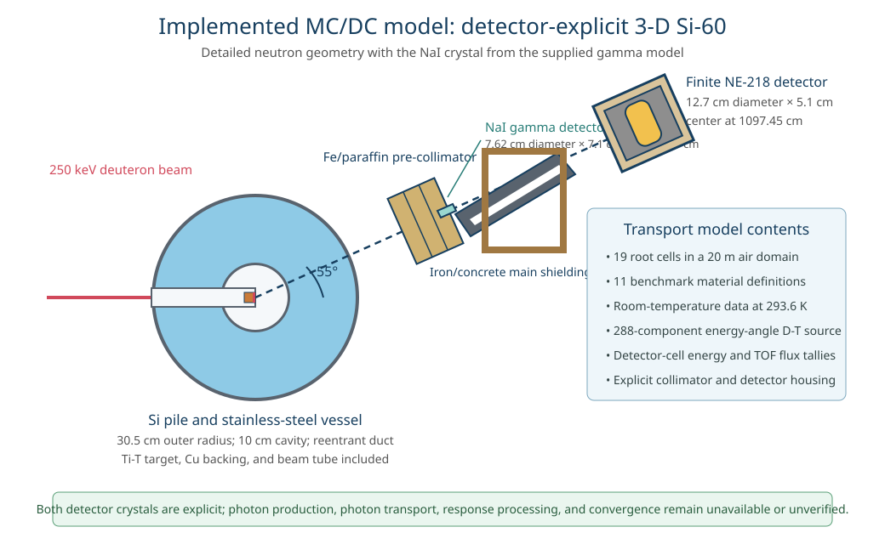
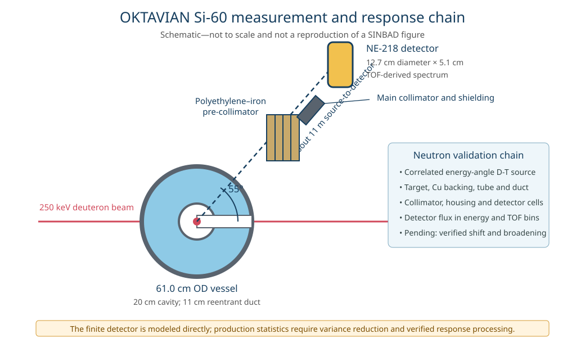

# OKTAVIAN Si-60 neutron leakage

This case represents the 60 cm silicon-pile experiment in SINBAD V2 benchmark **FUS-ATN-BLK-STR-PNT-003-FGS** (legacy entry NEA-1553/52), performed at the OKTAVIAN facility on 13 March 1987. The official package ranks the 60 cm experiment as benchmark quality for nuclear-data validation.

The experimental model consists of a spherical stainless-steel vessel filled with granular silicon around a central cavity and penetrated by a reentrant beam duct. A collimated detector line at 55 degrees to the deuteron-beam axis views the pile with an NE-218 neutron detector about 11 m from the target and a NaI photon detector about 5.8 m from the target. The MC/DC input implements the detailed, detector-explicit 3-D neutron model and includes the NaI crystal specified by the detailed gamma model as an explicit transport volume.

The experiment was driven by a pulsed D-T neutron source produced by 250 keV deuterons incident on a Ti-T target at the center of the pile. The source-neutron energy and yield vary with emission angle. The MC/DC model represents this correlated direction-dependent source law and normalizes calculated responses per emitted source neutron.

The benchmark quantities of interest are the energy-dependent **neutron-leakage spectrum** and **neutron-induced photon-leakage spectrum** emerging from the pile. The neutron energy spectrum was not measured calorimetrically at the pile surface: the NE-218 detector recorded a time-of-flight (TOF) spectrum along the collimated detector line, neutron energies were inferred from the measured flight times, the counts were corrected for detector efficiency, and the absolute leakage spectrum was normalized using the monitored source strength. The tabulated neutron quantity is therefore a processed leakage-current spectrum rather than the raw TOF counts. MC/DC estimates this response with detector-cell track-length flux tallied on both the experimental energy grid and the detailed model's TOF grid, with the energy-domain flux converted to the benchmark's far-field leakage normalization for comparison. The photon spectrum was obtained by unfolding the NaI pulse-height spectrum with the detector response matrix; MC/DC cannot yet produce or transport the benchmark photons, so the active comparison remains the neutron-leakage measurement.

## Implemented model

| Feature | MC/DC representation |
| --- | --- |
| Silicon pile | 10.0 cm-radius central cavity, 0.2 cm inner stainless-steel vessel, granular silicon to 30.0 cm, 0.5 cm outer vessel, and the reentrant beam duct |
| Source assembly | Ti-T target, copper backing, and stainless-steel beam tube on the deuteron-beam axis |
| Detector line | 55-degree line containing the iron/paraffin pre-collimator, main iron and concrete collimator/shielding, explicit NaI crystal, neutron-detector housing, and finite NE-218 scintillator |
| Atmosphere | Standard air in the cavity, duct, detector line, and the 20 m-radius calculation domain |
| Source law | Direction-dependent D-T yield and energy, spanning 13.36-14.89 MeV and correlated with emission angle |
| Detectors | 7.62 cm diameter by 7.1 cm-long NaI crystal from 580.0 to 587.1 cm, and a 12.7 cm diameter by 5.1 cm-long NE-218 cell centered 1097.45 cm from the target |
| Tallies | Detector-cell track-length flux on both the measured energy grid and the detailed model's TOF grid |
| Temperature | 293.6 K for every material, selecting room-temperature nuclear data |
| Comparison | Experimental spectrum, pointwise experimental uncertainty, MC/DC standard error, and C/E |
| Preferred range | 3-20.25 MeV first; results below 3 MeV are shown but shaded because the background treatment is incompletely specified |

All nuclide densities come from the provided detailed MCNP input. The silicon and stainless-steel isotope densities are prescribed values; they are not reconstructed from elemental mass fractions or present-day natural-abundance data. Natural-carbon and natural-argon entries used by that input are expanded into isotopes using the natural atom fractions accepted by MC/DC because its continuous-energy library is isotope based.

The benchmark does not specify a measured sample temperature or an MCNP `TMP` card. Its reference calculation instead uses the temperature of the selected ACE tables. The MC/DC input makes this implicit room-temperature choice explicit as 293.6 K. This is a computational-data assumption, not a measured temperature uncertainty.



## Running the model and comparison

`input.py` is self-contained: geometry, material densities, source law, and tally grids are defined explicitly and no model data are read from the SINBAD checkout at run time.

```sh
python input.py
```

The default is ten million histories in 20 batches. That is intended for model checkout and a preliminary spectrum. The reference 3-D calculation used five billion histories; a production MC/DC comparison needs a convergence study and an effective variance-reduction configuration.

The currently configured `MCDC_LIB` contains 15 of the 53 room-temperature isotope tables required by the detailed materials. A full run is presently blocked by missing Al-27, Ar-36/38/40, C-12/13, Ca-40/42/43/44/46/48, Cu-63/65, H-3, I-127, Mg-24/25/26, Mn-55, N-14/15, Na-23, Ni-58/60/61/62/64, P-31, S-32/33/34/36, and Ti-46/47/48/49/50 data. These tables must be generated from the intended LANL ACE evaluation before transport results can be produced.

The measured spectrum is not duplicated here. `plot.py` reads Table 3 from the licensed benchmark package. It finds a sibling SINBAD checkout automatically, or its location can be provided explicitly:

```sh
export SINBAD_OKTAVIAN_INPUTS=/path/to/oktav_si/00_Report/10_Inputs
python plot.py output.h5
```

The detector tally is a volume-averaged track-length flux in cm^-2 per source neutron. `plot.py` multiplies it by `4*pi*R^2`, with `R = 1097.45 cm`, and divides by the energy-bin lethargy width to obtain the scalar total-equivalent leakage used for the experimental comparison. This far-field interpretation follows the benchmark assessment, which notes that the reported total leakage is treated as a scalar quantity because the detector is far from the pile.

An optional relative normalization contribution can be displayed with, for example, `--normalization-uncertainty 0.01`. That is only a pointwise display convention; it does not create the missing covariance matrix.

## Source representation

The detailed source gives 37 direction-cosine, relative-yield, and neutron-energy values about the deuteron-beam axis. MC/DC does not yet accept a single continuous joint energy-angle distribution. `input.py` therefore divides each of the 36 tabulated direction-cosine intervals into eight subintervals. Each source component samples direction uniformly within its narrow interval, uses linearly interpolated yield for its probability, and uses the interpolated midpoint energy. The resulting 288-component mixture preserves the source anisotropy and energy-angle correlation to a controllable angular resolution.

The provided detailed model emits over a 0.3 cm-radius disk on the target. MC/DC currently has no exact disk-source sampler, so the input uses the disk center at `[0.0, 0.001, 0.0]` cm. This is a small spatial approximation, not a return to the isotropic or spherically symmetric source model.



## Model-specification gaps and possible discrepancy sources

Two comparisons must remain distinct: reproduction of the supplied detailed computational model and representation of the physical experiment. A prescription can be exact for the computational model while still being an imperfect description of the experiment.

### Reproduction of the detailed computational model

- **Source spot:** the 0.3 cm-radius disk is represented by its center point.
- **Continuous source correlation:** the source law is represented by 288 narrow angular components rather than one continuously interpolated joint distribution. Angular-subdivision convergence should be demonstrated.
- **Natural-element expansion:** natural carbon and argon are expanded with MC/DC's stated isotope fractions rather than transported with aggregate natural-element ACE tables. The effect should be checked if exact matching tables become available.
- **Transformed geometry:** the 55-degree transformation, rectangular shields, conical collimator, and detector housing are written explicitly in MC/DC constructive solid geometry. Their dimensions follow the detailed input, but an independent geometry comparison with MCNP remains advisable.
- **NaI apparatus:** the NaI crystal follows the detailed gamma model exactly: a 3.81 cm-radius cylinder spanning 580.0-587.1 cm on the detector axis, with equal Na-23 and I-127 atomic densities of 1.474435e-2 atoms/(barn cm). The surrounding geometry remains the detailed neutron configuration; the alternative, overlapping gamma-collimator regions from the gamma calculation are not merged into this neutron model.
- **Detector normalization:** direct energy-domain C/E uses the `4*pi*R^2` far-field conversion. A reference MCNP tally comparison should verify this normalization before it is used as a validation metric.
- **TOF processing:** the TOF tally uses the supplied binning, but the current plotting path does not yet reproduce the ACEFLX time shift and resolution broadening. The assessment recommends a 3.5 ns Gaussian standard deviation for the Si 3-D model and discusses a timing shift.
- **Nuclear-data realization:** evaluation, ACE processing temperature, table suffix, and physics settings must be recorded and aligned for code-to-code comparisons. Differences from the reference MCNP library are nuclear-data differences, not geometry or sampling errors.
- **Monte Carlo convergence:** the finite detector and long flight path require many histories. The ten-million-history default is much smaller than the five-billion-history reference calculation.

### Representation of the physical experiment

- **Silicon isotopic composition:** the prescribed computational isotope densities may differ from the physical sample. A separately documented natural-abundance reconstruction is a sensitivity case, not automatically a more authoritative model without assay data.
- **Silicon impurities:** the material is specified only as at least 99.9% pure. The identity, concentration, and spatial distribution of the remaining impurities are unavailable.
- **Granular-silicon density:** the model assumes a uniform apparent density of 1.29 g/cm3. Filling variation, settling, void distribution, and density uncertainty are not supplied.
- **Stainless-steel composition:** descriptions and supplied models use different steel definitions, especially for manganese and redistributed iron/nickel fractions. The computational composition may not exactly represent the manufactured vessel.
- **Target and source assembly:** the detailed calculation gives a usable target model, but the assessment identifies incomplete or inconsistent target information and unresolved source uncertainties.
- **Collimator, shielding, and housing:** some dimensions and material choices were inferred from experimental drawings in the benchmark evaluation and remain approximate.
- **Room structures:** air is represented, but the complete experimental room and its material details are not provided.
- **Detector efficiency and response:** the measured neutron spectrum depends on NE-218 efficiency and response treatment, while the measured photon spectrum was unfolded using a NaI response matrix. Complete reproducible response workflows are not supplied.
- **TOF data reduction:** the original time-domain data, exact time zero, flight-path convention, and full processing workflow are unavailable.
- **Background and room return:** the background-subtraction method and realistic low-energy effects are insufficiently documented, particularly below about 3 MeV.

## Experimental-uncertainty gaps

Table 3 reports pointwise one-standard-deviation counting statistics. It does not include the reported 0.4-1% niobium-foil/source-normalization uncertainty, and the package provides neither a covariance matrix nor a single prescribed normalization value.

Uncertainties in the angular source yield, source energy, detector response, timing, geometry, material composition, background subtraction, and model form are not supplied as a benchmark covariance. Consequently:

- assess 3-20.25 MeV first;
- treat plotted C/E bars as pointwise displays rather than a complete goodness-of-fit statistic;
- do not assign a formal pass/fail threshold until correlated and model uncertainties are defined; and
- keep sub-3 MeV results diagnostic until the missing background information is resolved.

## Current MC/DC limitations

The detailed neutron geometry and a finite detector-cell tally are representable. Remaining code/workflow limitations are:

- no exact cylindrical-disk source sampler;
- no single native continuous joint energy-angle source distribution, requiring the convergent source-mixture approximation described above;
- no MCNP-style point-detector/next-event estimator, so the detector-cell calculation needs substantially more histories and a validated variance-reduction strategy;
- no built-in OKTAVIAN detector-efficiency treatment, Gaussian TOF broadening, timing shift, TOF-to-energy conversion, or ACEFLX-equivalent processing; and
- no neutron-induced photon production and photon transport, so the explicit NaI crystal cannot yet score the companion gamma-leakage spectrum or model its pulse-height response.

MC/DC already supplies the continuous-energy neutron transport, explicit-isotope materials, 3-D constructive solid geometry, detector-cell track-length flux, energy/time filters, multiple weighted source components, batch statistics, and weight-window mechanism used by this implementation.

## Interpretation note

> **Detector-explicit model:** This input represents the detailed 3-D neutron experiment. A C/E result should nevertheless be labeled preliminary until source-discretization, geometry, detector normalization, TOF response, nuclear-data identity, variance reduction, and Monte Carlo convergence have been verified.

The energy-domain result is useful immediately for checking evaluated-data-driven neutron transport through the detailed apparatus. The TOF tally is retained so the benchmark's recommended response treatment can be added without changing the transport model.

## Package notes

- `oksi-exp.md` contains the tabulated 60 cm neutron measurement and pointwise errors.
- Some migrated descriptions incorrectly label the supplied Si-60 detailed inputs as 40 cm; the input geometry itself has a 30.5 cm outer vessel radius and identifies the 60 cm experiment.
- The source and neutron-apparatus geometry follow the detailed neutron model in the provided package; the NaI crystal definition comes from the provided detailed gamma model.
- Modern V2 model, evaluation, results, and continuous-testing directories are empty; the substantive benchmark content remains under the report inputs.

## Files

- `input.py` defines the self-contained detector-explicit 3-D neutron model.
- `plot.py` converts detector flux to total-equivalent leakage, overlays the experiment, and plots C/E.
- `figures/model-geometry.svg` summarizes the implemented 3-D transport model.
- `figures/measurement-layout.svg` summarizes the measured arrangement and the remaining response-processing steps.
